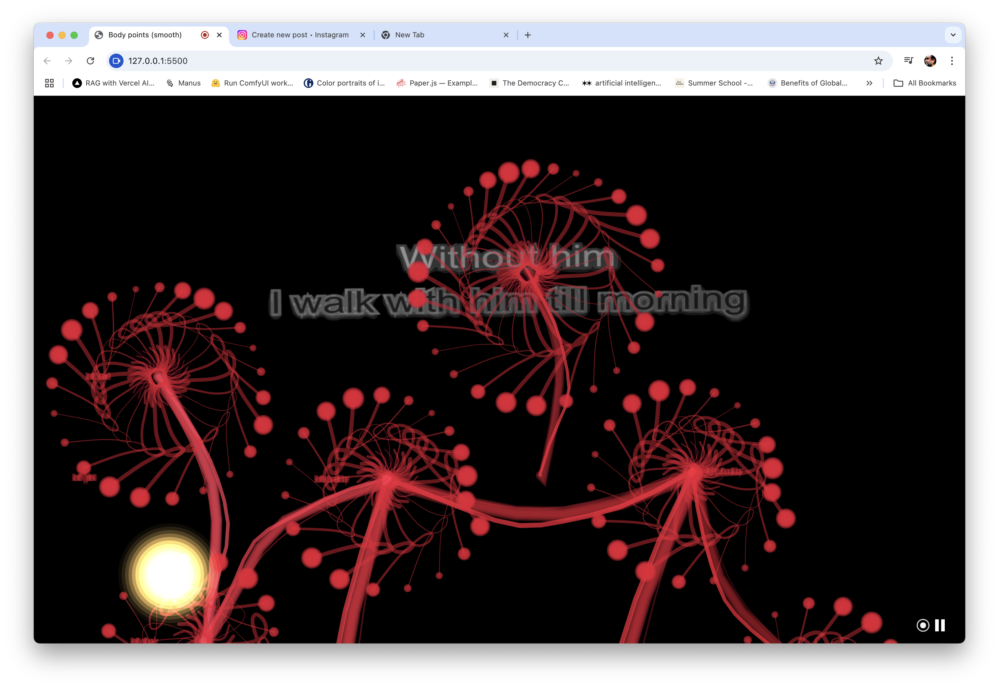
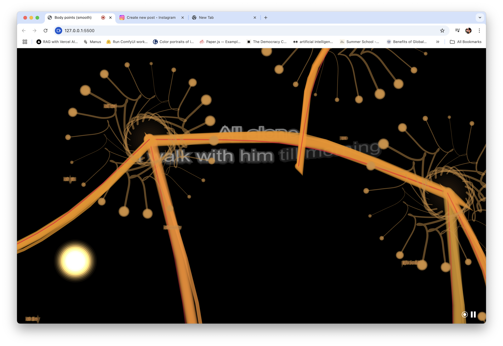

# Impossible Simplicity
by Marlon Barrios Solano

## About
This interactive video performance system is part of "Duets in Latent Space", exploring the intersection of human movement, machine learning, and real-time video manipulation. The system creates a dynamic, responsive environment where video content morphs and flows in response to the performer's movements.

## Concept
The work investigates the relationship between human gesture and digital response, creating a duet between the performer and the machine learning system. Through body tracking and real-time video manipulation, the piece explores themes of presence, embodiment, and the latent space between human and machine interaction.

## Technical Implementation
- Built with p5.js and MediaPipe for body tracking
- Real-time video manipulation and effects
- Audio-reactive elements
- Dynamic scaling and movement based on performer's gestures
- Black and white video processing
- Interactive lighting and particle systems
- Body-driven video transformations
- Real-time audio analysis and response
- Smooth transitions using lerp functions

## Features
- Dynamic video scaling based on body movement
- Black and white video processing with contrast enhancement
- Audio-reactive elements affecting video behavior
- Interactive particle systems
- Body tracking with MediaPipe
- Real-time video manipulation
- Smooth transitions and organic movements

## Requirements
- Modern web browser with webcam access
- Microphone access for audio reactivity
- Sufficient lighting for body tracking

## Music
"Les Misérables" piano arrangement by Karafun

## Credits
Programming and Performance: Marlon Barrios Solano
Part of: Duets in Latent Space

## [GO TO LIVE APP](https://marlonbarrios.github.io/impossible-simplicity/)

Created during an artistic research residency at [Lake Studios Berlin](https://lakestudiosberlin.com/) in February 2024

## License
© 2024 Marlon Barrios Solano
All rights reserved. This work may not be reproduced, distributed, or modified without explicit permission from the artist.

For inquiries and permissions, please contact Marlon Barrios Solano.
